# 참참참 - 초보 농업인을 위한 영농 코칭 플랫폼

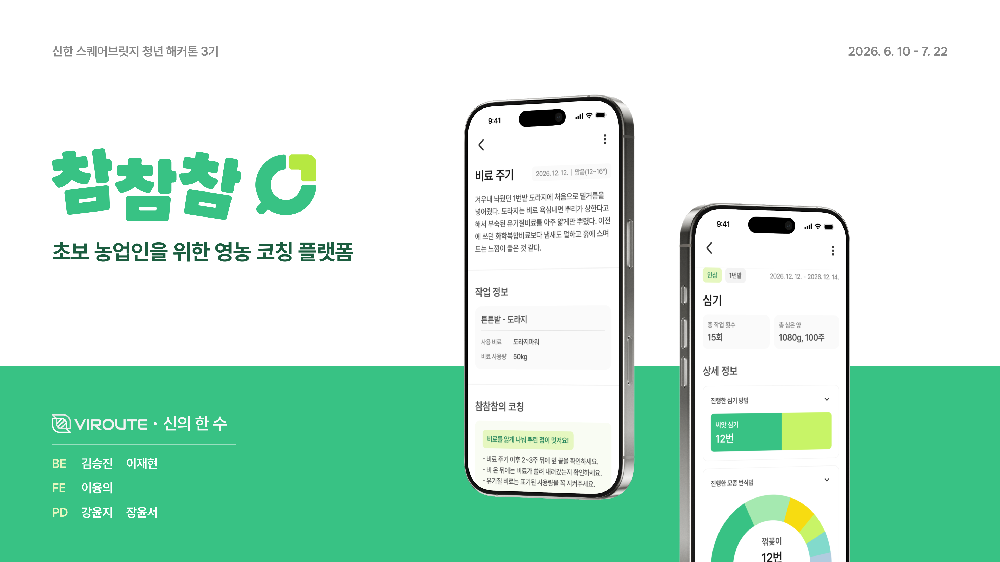

<br />

> 농업이 처음이어도 괜찮아요.
> 내 작물과 재배지에 맞는 정보를 찾고, 텍스트·음성으로 영농 기록을 남기며,
> 기록을 다음 농사 판단으로 연결하는 코칭 플랫폼입니다.

<br />

<p align="center">
  <strong>신한 스퀘어브릿지 청년 해커톤 3기</strong><br />
  팀 <strong>신의 한 수</strong> · 2026.06.10 – 2026.07.22
</p>

<p align="center">
  <a href="./docs/chamchamcham-presentation.pdf">발표자료 전체 PDF</a>
  ·
  <a href="./frontend/docs/swagger/README.md">API 계약 문서</a>
</p>

<br />

## 문제 정의
<div>
  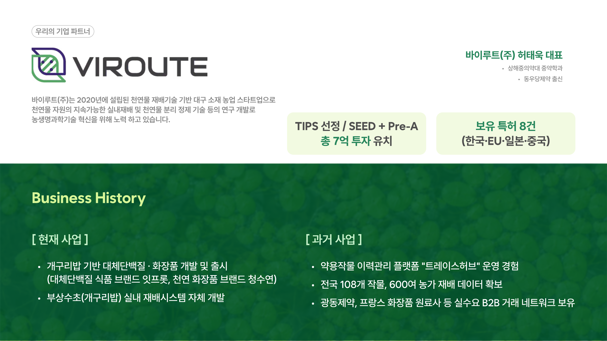
  <br />
  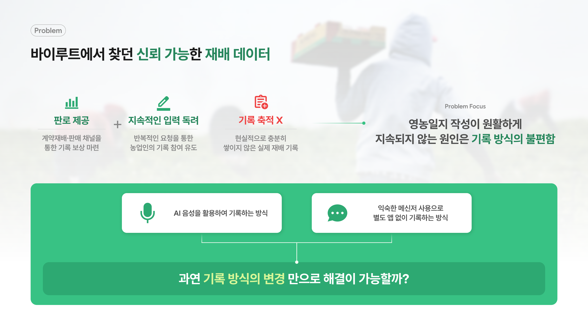
  <br />
  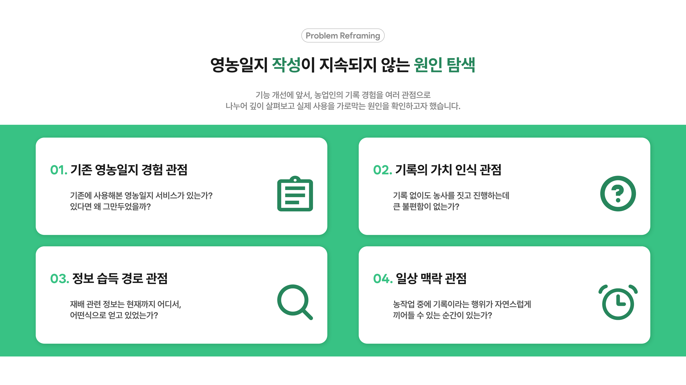
  <br />
  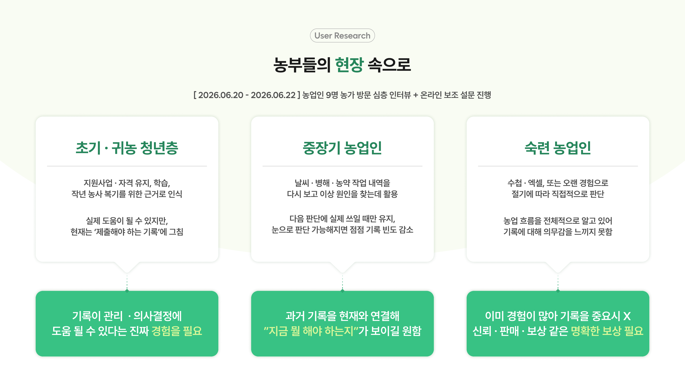
  <br />
  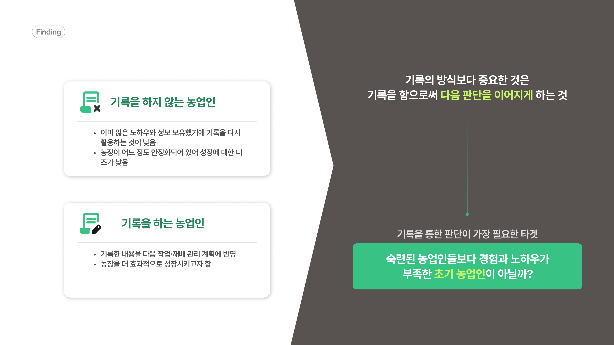
  <br />
  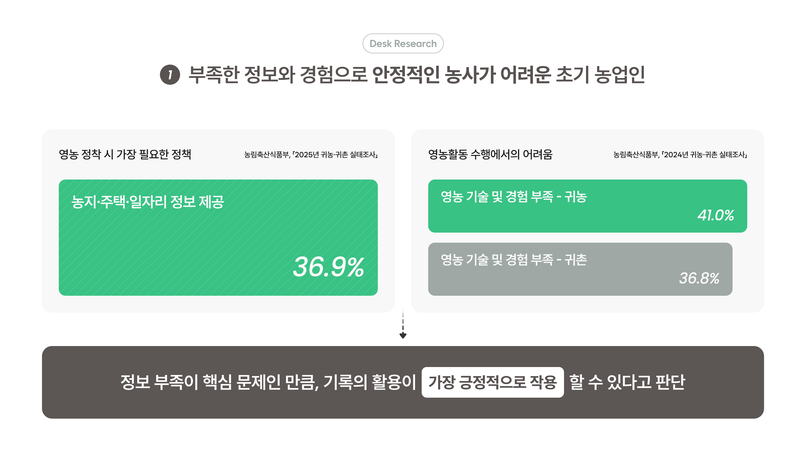
  <br />
  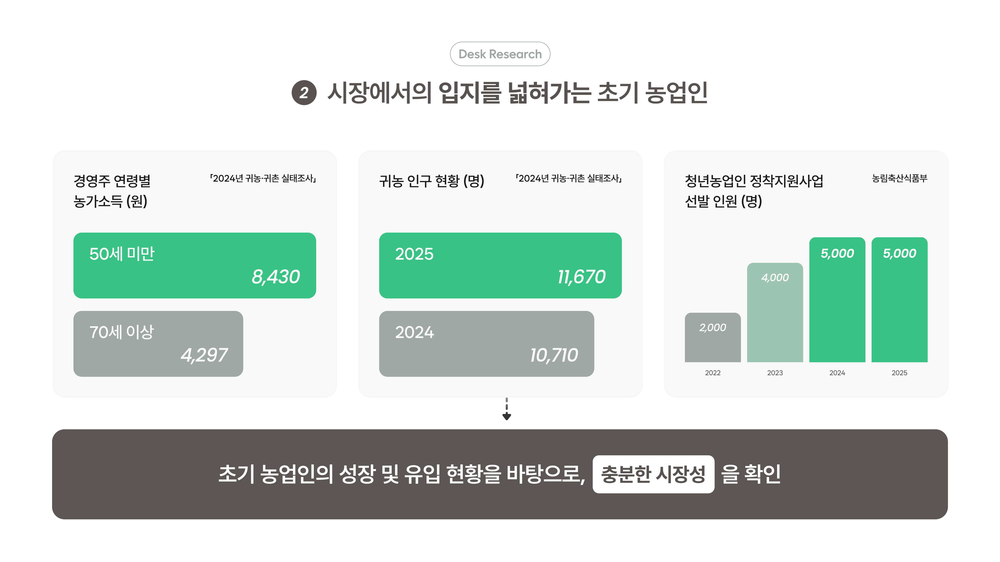
  <br />
  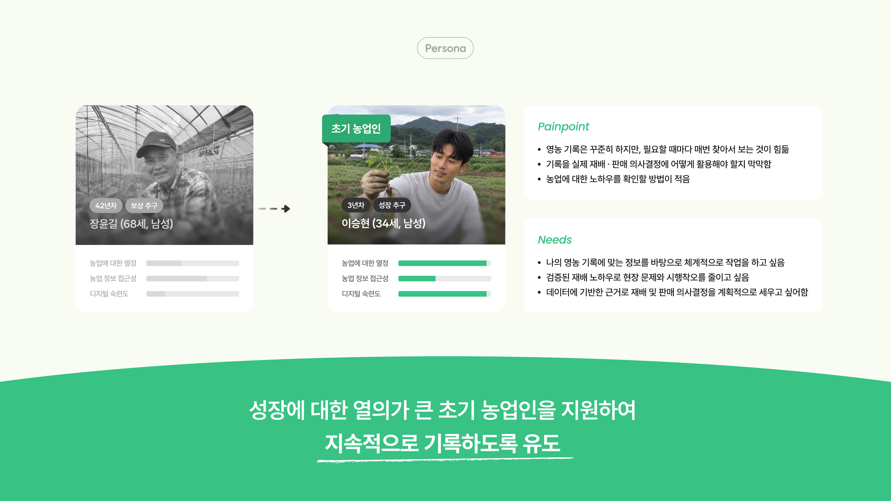
  <br />
  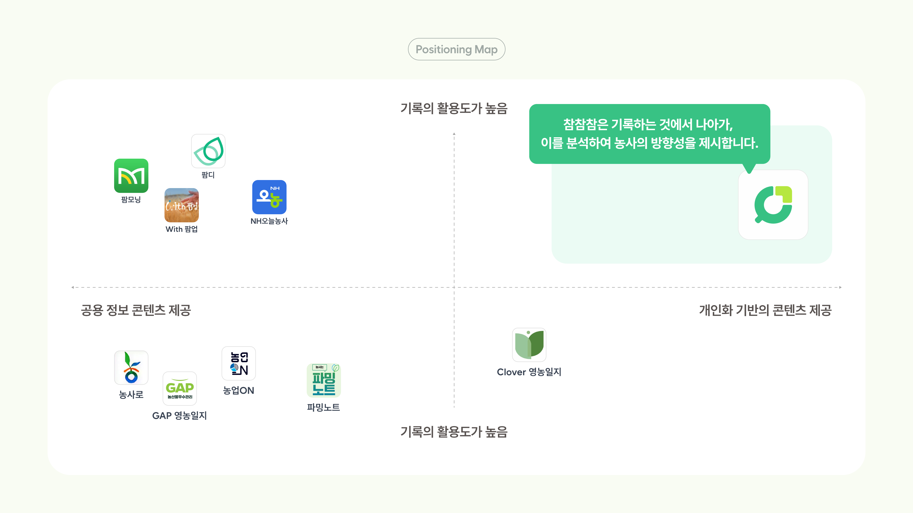
</div>

<br />

## 주요 기능

<table>
  <tr>
    <td align="center" valign="top" width="33%">
      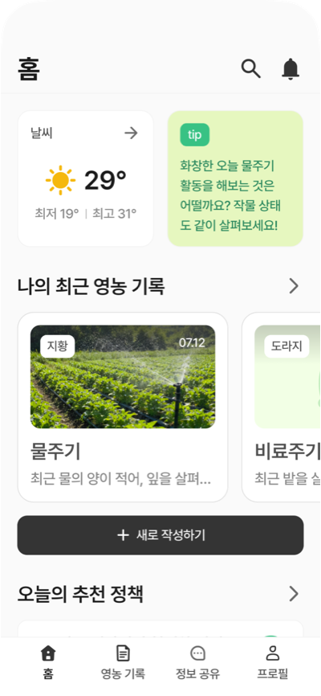
      <br /><br />
      <b>필요한 농업 정보는 한 눈에</b>
      <br />
      <sub>홈 화면에서는 초보 농업인이 필요한 정보를 한 번에 확인할 수 있어요.</sub>
    </td>
    <td align="center" valign="top" width="33%">
      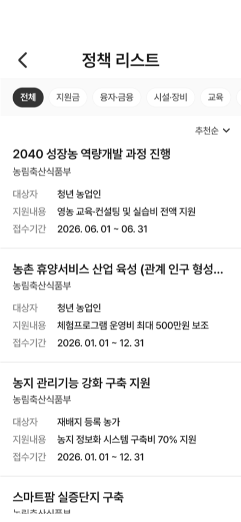
      <br /><br />
      <b>맞춤형 추천 정책 제공</b>
      <br />
      <sub>사용자 정보(귀농 연차, 작물, 재배지)와 자격 조건을 기준으로 추천 정책 정렬</sub>
    </td>
    <td align="center" valign="top" width="33%">
      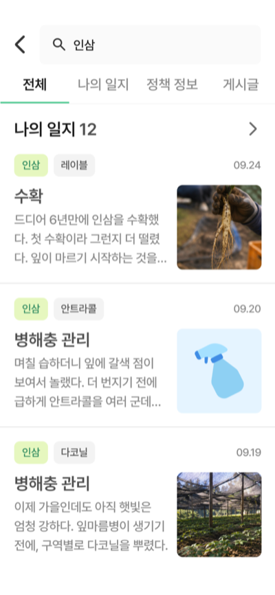
      <br /><br />
      <b>통합 검색 제공</b>
      <br />
      <sub>콘텐츠(일지, 정책, 게시글) 키워드 인덱싱 → 통합 검색을 통한 다양한 정보 탐색 지원</sub>
    </td>
  </tr>
  <tr>
    <td align="center" valign="top" width="33%">
      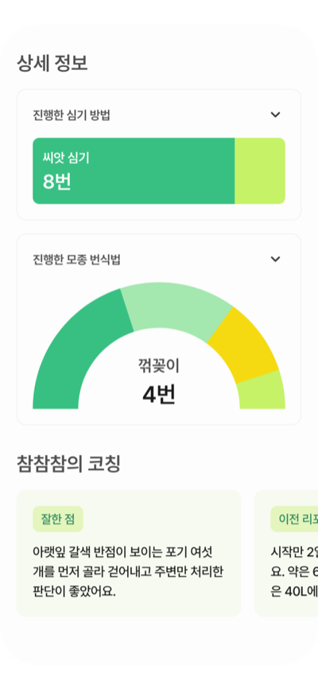
      <br /><br />
      <b>다양한 기록을 하나의 콘텐츠로</b>
      <br />
      <sub>한 작기의 기록을 활동별로 모아 그래프로 정리하고, 코칭으로 다음 할 일까지 제공합니다.</sub>
    </td>
    <td align="center" valign="top" width="33%">
      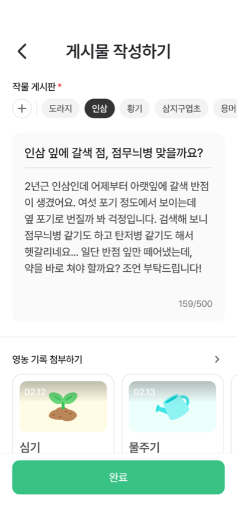
      <br /><br />
      <b>농사에 대한 궁금증은 여기에서!</b>
      <br />
      <sub>다양한 궁금증을 가진 초기 농업인을 위해, 서로 묻고 답하며 노하우를 나눌 수 있는 커뮤니티를 제공합니다.</sub>
    </td>
    <td align="center" valign="top" width="33%">
      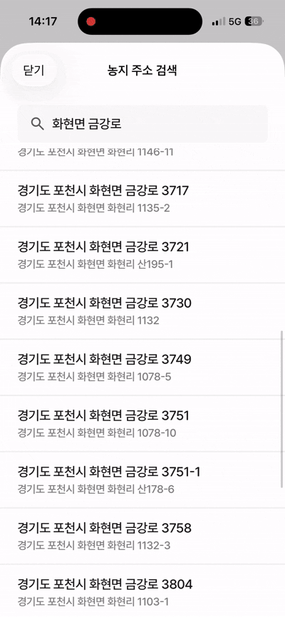
      <br /><br />
      <b>재배지 주소 검색</b>
      <br />
      <sub>주소가 없는 농지도 주소·필지 검색으로 빠르게 등록</sub>
    </td>
  </tr>
  <tr>
    <td align="center" valign="top" width="33%">
      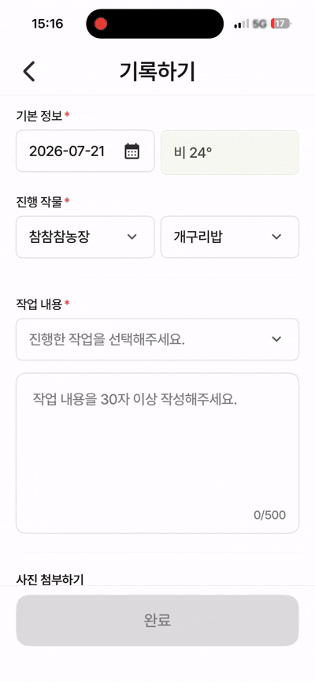
      <br /><br />
      <b>영농 기록 작성</b>
      <br />
      <sub>작물·작업·날씨 정보를 입력하고 사진과 함께 기록</sub>
    </td>
    <td align="center" valign="top" width="33%">
      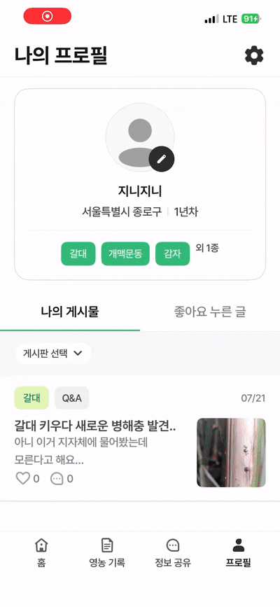
      <br /><br />
      <b>프로필·게시물 확인</b>
      <br />
      <sub>내 작물 정보와 작성한 영농 게시물을 한 곳에서 관리</sub>
    </td>
  </tr>
</table>

<br />

## 기술적으로 해결한 문제

### 현장에서 긴 글을 쓰기 어려운 문제

- OpenAI Realtime API와 WebRTC 직접 연결로 실시간 음성 기록 구현
- 사용자 작물·재배지 정보를 system instruction에 반영
- Function Calling의 `enum`·`required` 제약으로 필수 영농 정보 입력 유도

### 주소가 없는 재배지를 등록하기 어려운 문제

- JUSO와 국토교통부 V-World API를 이용한 주소·필지 검색
- 지도 polygon draw를 이용한 미등록 농지 등록
- 좌표 기반 면적·평수 계산과 PNU·토지 용도·출처 저장

### 기록을 다음 판단으로 연결하기 어려운 문제

- 작물·작업 유형에 맞는 공식 농업 기술 문서를 벡터 DB에서 검색
- 사용자의 영농 기록과 검색된 근거를 함께 사용해 사후 행동 추천
- 작기별 작업 기록을 집계해 리포트와 코칭으로 연결

<br />

## API Docs

| 구분 | URL / 문서 |
|------|-----------|
| Swagger UI | `http://localhost:8080/swagger-ui.html` |
| OpenAPI JSON | `http://localhost:8080/v3/api-docs` |
| API 계약 스냅샷 | [`frontend/docs/swagger/openapi.json`](./frontend/docs/swagger/openapi.json) |
| API 요약 | [`frontend/docs/swagger/summary.md`](./frontend/docs/swagger/summary.md) |

<br />

## 기술 스택

### iOS

- **Swift / SwiftUI** - iOS 앱 UI와 화면 흐름
- **SwiftData** - 로컬 모델 및 화면 상태 관리
- **MapKit** - 재배지 지도와 polygon 입력
- **WebRTC** - 실시간 음성 세션 연결

### Backend

- **Kotlin 1.9.25**
- **Spring Boot 3.5.4**
- **Spring Web MVC** - REST API
- **Spring Data JPA** - 영속성 및 도메인 조회
- **Gradle 멀티 모듈** - `api`, `application`, `domain`, `batch` 분리
- **Spring Security / JWT / OIDC** - 인증·인가

### Database & Cache

- **PostgreSQL** - 영농·회원·정책·커뮤니티 데이터
- **pgvector** - RAG 임베딩 검색
- **Redis** - 인증 코드·토큰 상태·캐시
- **Caffeine** - 기상 정보 캐시

### AI & External API

- **OpenAI Realtime API** - 실시간 음성 기록
- **Spring AI / Ollama / OpenClaw** - RAG 코칭 파이프라인
- **기상청 API** - 날씨·예보 정보
- **JUSO / V-World API** - 주소·필지·토지 정보
- **농약안전정보시스템(PSIS)** - 농약·병해충 데이터
- **Kakao / Naver / Apple** - 소셜 로그인

<br />

## 프로젝트 구조

```text
ChamChamCham/
├── backend/
│   ├── api/            # Controller, DTO, 인증·외부 연동
│   ├── application/    # 유스케이스·애플리케이션 서비스
│   ├── domain/         # 엔티티·리포지토리·도메인 규칙
│   └── batch/          # 배치 작업
├── frontend/
│   └── ChamChamCham/   # SwiftUI iOS 앱
├── data/               # RAG 원천 데이터와 전처리 자료
├── docs/
│   ├── assets/         # README 이미지·기능 GIF
│   └── chamchamcham-presentation.pdf
├── docker-compose.yml
└── .env.example
```

<br />

## 시작하기

### 요구사항

- JDK 21
- Xcode 및 iOS Simulator
- PostgreSQL + pgvector
- Redis
- 외부 API 및 소셜 로그인 설정값

### 환경 변수

환경 변수 예시는 [`.env.example`](./.env.example)에서 확인할 수 있습니다. 실제 키·토큰·비밀번호는 저장소에 커밋하지 마세요.

### Backend 실행

```bash
cd backend
./gradlew :api:bootRun
```

### Backend 테스트

```bash
cd backend
./gradlew test
```

### iOS 실행

1. Xcode에서 [`frontend/ChamChamCham/ChamChamCham.xcodeproj`](./frontend/ChamChamCham/ChamChamCham.xcodeproj)를 엽니다.
2. `ChamChamCham` 스킴과 iOS Simulator를 선택합니다.
3. 백엔드 주소와 로그인 SDK 설정을 적용한 뒤 실행합니다.

<br />

## MVP 및 향후 계획

### MVP

- [x] Polygon draw 기반 재배지 등록
- [x] 텍스트·음성 영농 기록
- [x] RAG 기반 코칭 콘텐츠
- [x] 영농 활동 카테고리별 리포트
- [x] 농업인 커뮤니티

### 고도화 계획

- 농업 전문 행정 기관 연계를 통한 데이터 정합성 강화
- 다중 AI 에이전트 기반 답변 검증 플로우
- 영농 기록 기반 지원금 신청 서류 자동 작성
- 지역 병해충 발생 및 예상 생산량·품질·수익 분석

<br />

## 팀 신의 한 수

| 이름 | 역할 | 담당 범위 |
|------|------|-----------|
| 김승진 | Backend | 텍스트·음성 영농 기록, 날씨 조회, 통합 검색 |
| 이재현 | Backend | 소셜 로그인·프로필, 정책 수집·추천, 리포트 통계, RAG 코칭, 커뮤니티 |
| 이융의 | Frontend | iOS 전체 화면·백엔드 연동, polygon 농경지 조회, 앱스토어 배포·운영 |
| 강윤지 | Product Design | 경쟁 조사, 와이어프레임·화면 기획, 디자인 시스템, UI 브랜딩, PPT 디자인 |
| 장윤서 | Product Design | 경쟁 조사, 와이어프레임 화면 구성, 온보딩·검색·프로필 플로우, 심볼·PPT 디자인 |

프로젝트 공통으로 농업인 인터뷰, 페르소나 도출, 서비스 아이데이션, IA·사용자 플로우 설계, QA와 기능 고도화를 진행했습니다.

<br />

## 개발 규칙

- Kotlin 멀티 모듈 의존 방향은 `api → application → domain`을 유지합니다.
- 도메인 용어 `member`를 사용하고 프로젝트 소유의 `user` 명칭을 재도입하지 않습니다.
- 요청 형태 검증은 API 경계에서 처리하고, 비즈니스 규칙은 애플리케이션 서비스에서 관리합니다.
- 민감한 값은 환경 변수 또는 배포 Secret으로 관리합니다.
- 기능 변경 후 관련 테스트를 실행하고, 전체 테스트가 필요한 경우 결과를 함께 기록합니다.

<br />

## 브랜치 전략

```text
main
└── dev
    └── feat/feature-name
```

개발 브랜치는 `dev`에서 생성하고, 기능 단위로 작은 변경을 유지합니다.

<br />

## 커밋 컨벤션

| 타입 | 설명 |
|------|------|
| `feat` | 새로운 기능 |
| `fix` | 버그 수정 |
| `refactor` | 동작을 유지하는 구조 개선 |
| `docs` | 문서 수정 |
| `test` | 테스트 추가·수정 |
| `chore` | 빌드·설정·기타 작업 |

예시:

```text
feat(coaching): 영농 기록 기반 RAG 코칭 응답 추가
fix(auth): 소셜 로그인 nonce 재사용 처리 수정
docs(readme): 프로젝트 실행 및 기능 문서 보강
```

<br />

## 문서

- [발표자료 전체 PDF](./docs/chamchamcham-presentation.pdf)
- [Frontend 문서](./frontend/docs)
- [Backend 가이드](./backend/AGENTS.md)
- [영농 기록·음성 검증 핸드오프](./docs/voice-verification-handoff.md)
- [RAG 데이터 설명](./data/rag/medicinal-plants/README.md)
- [Swagger API 계약](./frontend/docs/swagger/README.md)

<br />