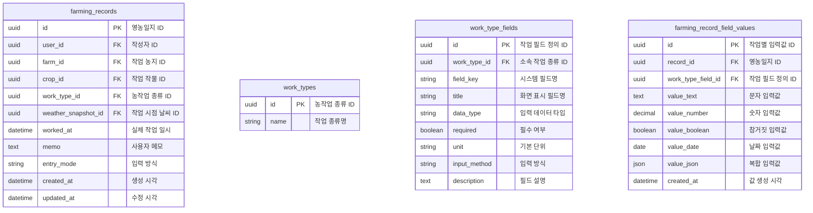

# 바이루트 요구사항 명세 및 ERD

## ERD

아래 Mermaid 코드는 ERD 시각화를 위한 원본이다. Notion에서 Mermaid 렌더링이 제한되는 환경이라면, 바로 아래의 `ERD 관계 요약` 표를 사용하면 된다.

```mermaid
erDiagram
    users {
        uuid id PK "사용자 고유 ID"
        string email "로그인 이메일"
        string phone "연락처"
        enum status "계정 상태 (탈퇴 여부)"
        string name "사용자 실명"
        string nickname "(선택) 서비스 표시 이름"
        string region "사용자 거주 또는 활동 지역"
        string experience_level "영농 경험 수준"
        enum management_type "농업경영체인지 아닌지"
        datetime created_at "가입 시각"
        datetime updated_at "정보 수정 시각"
        datetime withdrawn_at "회원탈퇴 시각"
    }

    farms {
        uuid id PK "농지 또는 필지 ID"
        uuid owner_user_id FK "소유 사용자 ID"
        string name "농지 이름"
        string region "시도 또는 광역 지역"
        string city "시군구"
        string street "상세 주소"
        datetime created_at "농지 등록 시각"
    }

    crops {
        uuid id PK "작물 ID"
        string name "작물명"
        string category "작물 분류"
        string lifecycle_type "일반 또는 다년생 구분"
        string default_unit "기본 수량 단위"
    }

    user_crops {
        uuid id PK "사용자 재배 작물 ID"
        uuid user_id FK "사용자 ID"
        uuid farm_id FK "재배 농지 ID"
        uuid crop_id FK "작물 ID"
        integer planting_year "정식 또는 재배 시작 연도"
        string status "재배 상태"
        date started_on "재배 시작일"
    }

    policy_programs {
        uuid id PK "정책 원본 ID"
        string title "정책명"
        string body "정책 상세 내용"
        string region "대상 지역"
        enum target_management_type "대상 농업경영체 유형"
        date apply_starts_on "신청 시작일"
        date apply_ends_on "신청 종료일"
        string source_url "정책 출처 URL"
    }

    policy_recommendations {
        uuid id PK "정책 추천 ID"
        uuid user_id FK "추천 대상 사용자 ID"
        uuid policy_program_id FK "추천 정책 ID"
        decimal score "추천 점수"
        string reason "추천 사유"
        datetime created_at "추천 생성 시각"
    }

    farming_records {
        uuid id PK "영농일지 ID"
        uuid user_id FK "작성자 ID"
        uuid farm_id FK "작업 농지 ID"
        uuid crop_id FK "작업 작물 ID"
        uuid work_type_id FK "농작업 종류 ID"
        uuid weather_snapshot_id FK "작업 시점 날씨 ID"
        datetime worked_at "실제 작업 일시"
        text memo "사용자 메모"
        string entry_mode "입력 방식"
        datetime created_at "생성 시각"
        datetime updated_at "수정 시각"
    }

    work_types {
        uuid id PK "농작업 종류 ID"
        string name "작업 종류명"
    }

    work_type_fields {
        uuid id PK "작업 필드 정의 ID"
        uuid work_type_id FK "소속 작업 종류 ID"
        string field_key "시스템 필드명"
        string title "화면 표시 필드명"
        string data_type "입력 데이터 타입"
        boolean required "필수 여부"
        string unit "기본 단위"
        string input_method "입력 방식"
        text description "필드 설명"
    }

    farming_record_field_values {
        uuid id PK "작업별 입력값 ID"
        uuid record_id FK "영농일지 ID"
        uuid work_type_field_id FK "작업 필드 정의 ID"
        text value_text "문자 입력값"
        decimal value_number "숫자 입력값"
        boolean value_boolean "참거짓 입력값"
        date value_date "날짜 입력값"
        json value_json "복합 입력값"
        datetime created_at "값 생성 시각"
    }

    record_media {
        uuid id PK "첨부 미디어 ID"
        uuid record_id FK "영농일지 ID"
        string media_type "미디어 유형"
        string file_url "파일 URL"
        string status "처리 상태 -> 사진서버랑 일치한지 안 한지"
        datetime created_at "첨부 시각"
    }

    voice_record_sessions {
        uuid id PK "음성 기록 세션 ID"
        uuid user_id FK "사용자 ID"
        uuid draft_record_id FK "임시 영농일지 ID"
        string status "세션 상태"
        string transcript "전체 음성 전사문"
        datetime created_at "세션 시작 시각"
        datetime confirmed_at "최종 확인 시각"
    }
    

    voice_record_turns {
        uuid id PK "음성 대화 턴 ID"
        uuid session_id FK "음성 기록 세션 ID"
        string role "발화 주체"
        text content "발화 내용"
        json extracted_fields "턴별 추출 필드(구현해보면서 ㅏㅎ"
        datetime created_at "발화 시각"
    }
    
    coaching_feedback {
        uuid id PK "피드백 ID"
        uuid user_id FK "피드백 대상 사용자 ID"
        **uuid record_id FK "(선택) 단일 영농일지 ID"**
        enum feedback_type "단일 영농일지 피드백인지/전체 통계 기반 피드백인지"
        date period_starts_on "분석 시작일"
        date period_ends_on "분석 종료일"
        uuid crop_id FK "(선택) 작물 필터"
        text summary "피드백 요약"
        text next_actions "다음 행동 제안"
        json input_summary "AI에 보낸 요약 데이터"
        json source_refs "근거 기록 참조"
        string model_name "사용 모델명"
        datetime created_at "피드백 생성 시각"
    }

    community_posts {
        uuid id PK "게시글 ID"
        uuid author_user_id FK "작성자 ID"
        uuid farming_record_id FK "(선택) 공유 영농일지 ID"
        string post_type "게시글 성격(자유, Q&A)"
        string title "게시글 제목"
        text body "게시글 본문"
        enum status "게시글 상태"
        datetime created_at "작성 시각"
    }

    community_comments {
        uuid id PK "댓글 ID"
        uuid post_id FK "게시글 ID"
        **uuid parent_comment_id FK "(선택)상위 댓글 ID"**
        uuid author_user_id FK "작성자 ID"
        text body "댓글 본문"
        **boolean accepted_answer "채택 답변 여부(default false)"**
        datetime created_at "작성 시각"
        boolean isDeleted
    }

    notification_preferences { // 알람은 구현 과정에서 결정됨.
        uuid id PK "알림 설정 ID"
        uuid user_id FK "사용자 ID"
        string channel "알림 채널"
        string topic "알림 주제"
        boolean enabled "수신 여부"
        datetime updated_at "수정 시각"
    }

    legal_documents {
        uuid id PK "약관 문서 ID"
        string document_type "문서 유형"
        string title "문서 제목"
        string version "문서 버전"
        text body "문서 본문"
        datetime published_at "게시 시각"
    }

    user_consents {
        uuid id PK "사용자 동의 ID"
        uuid user_id FK "사용자 ID"
        uuid legal_document_id FK "동의 문서 ID"
        boolean agreed "동의 여부"
        datetime agreed_at "동의 시각"
    }

    users ||--o{ farms : owns
    users ||--o{ user_crops : grows
    farms ||--o{ user_crops : hosts
    crops ||--o{ user_crops : selected_as
    farms ||--o{ weather_snapshots : receives
    users ||--o{ policy_recommendations : receives
    policy_programs ||--o{ policy_recommendations : recommended_as
    users ||--o{ farming_records : writes
    farms ||--o{ farming_records : stores
    crops ||--o{ farming_records : records
    work_types ||--o{ farming_records : classifies
    weather_snapshots ||--o{ farming_records : captured_for
    work_types ||--o{ work_type_fields : defines
    farming_records ||--o{ farming_record_field_values : has
    work_type_fields ||--o{ farming_record_field_values : stores
    farming_records ||--o{ record_media : has
    farming_records ||--o{ ai_parse_results : parsed_by
    users ||--o{ voice_record_sessions : starts
    farming_records ||--o{ voice_record_sessions : confirms
    voice_record_sessions ||--o{ voice_record_turns : contains
    farming_records ||--o{ coaching_feedback : receives
    users ||--o{ coaching_feedback : sees
    users ||--o{ report_snapshots : owns
    farms ||--o{ report_snapshots : summarizes
    crops ||--o{ report_snapshots : summarizes
    crops ||--o{ community_posts : categorizes
    farming_records ||--o{ community_posts : shared_as
    users ||--o{ community_posts : writes
    community_posts ||--o{ community_comments : has
    community_comments ||--o{ community_comments : replies
    users ||--o{ community_comments : writes
    users ||--o{ notification_preferences : configures
    legal_documents ||--o{ user_consents : governs
    users ||--o{ user_consents : grants
```




## 요구사항 명세서

1. 온보딩
    1. 회원가입/로그인
    2. 주소 등록
2. 기록하기 → AI 써서 사용자 응답 파싱해서 답하기
    1. 음성
    2. 텍스트
3. 리포트 → AI RAG 구현해서 하기
    1. 영농일지별 코칭
    2. 전체 코칭
4. 커뮤니티
    1. 글 작성
    2. 댓글
5. 마이페이지
    1. 내정보 확인
6. 검색 및 정보 추출
7. 정책 추천